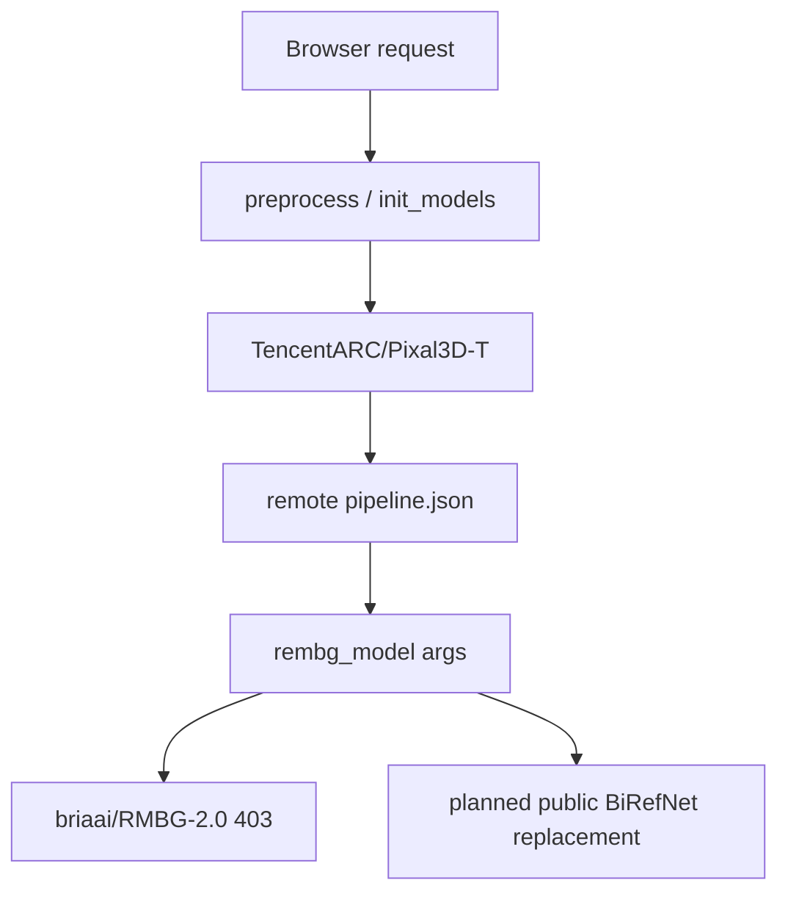

# Recover Pixal3D Space

## Scope And Assumptions
- Target the direct Space defined by [README.md](README.md) (`app_file: app.py`) and the repo remote `th3w1zard1/Pixal3D`, not the proxy-only fallback in [app_proxy.py](app_proxy.py).
- Treat GPU-backed Space deployment as the intended runtime. The current app is CUDA-only in practice (`.cuda()`, `torch.cuda.synchronize()`, `nvdiffrast`, `o_voxel`), so CPU success is not a realistic primary target.
- Keep the proxy flow in [app_proxy.py](app_proxy.py) and [app_local.py](app_local.py) as contingency/reference only, not the main success path.
- The installed Hugging Face MCP server is present, but live MCP calls are currently blocked before request dispatch in this environment. Because the user explicitly asked for that path, implementation should validate MCP availability up front before depending on it for Space inspection.

## Failure Path To Fix
- [app.py](app.py) bootstraps the Space through `init_models()` and `Pixal3DImageTo3DPipeline.from_pretrained("TencentARC/Pixal3D-T")`.
- [trellis2/pipelines/base.py](trellis2/pipelines/base.py) and [trellis2/pipelines/__init__.py](trellis2/pipelines/__init__.py) download `pipeline.json` and model artifacts from the Hub without any auth/cache control.
- [trellis2/pipelines/pixal3d_image_to_3d.py](trellis2/pipelines/pixal3d_image_to_3d.py) constructs `rembg_model` from the remote pipeline args, so the repo-local default in [trellis2/pipelines/rembg/BiRefNet.py](trellis2/pipelines/rembg/BiRefNet.py) is being overridden by the remote `TencentARC/Pixal3D-T` config.
- [trellis2/pipelines/rembg/BiRefNet.py](trellis2/pipelines/rembg/BiRefNet.py) then calls `AutoModelForImageSegmentation.from_pretrained(model_name, trust_remote_code=True)` with no token, revision, or local-cache override, which is why the remote `briaai/RMBG-2.0` reference crashes the Space with a 403.

## Technical Direction
1. Add a local model-resolution layer before pipeline construction.
   - Introduce a small resolver around [trellis2/pipelines/base.py](trellis2/pipelines/base.py), [trellis2/pipelines/__init__.py](trellis2/pipelines/__init__.py), and [trellis2/pipelines/pixal3d_image_to_3d.py](trellis2/pipelines/pixal3d_image_to_3d.py) that can download/read `pipeline.json`, patch gated `rembg_model` entries, and instantiate the pipeline from a local, explicit config rather than blindly trusting the remote BRIA reference.
   - Make background-removal model selection explicit and env-configurable. Default to the open BiRefNet family because it is the closest quality/architecture match to RMBG-2.0: start with `ZhengPeng7/BiRefNet` for full-quality GPU runs and keep `ZhengPeng7/BiRefNet_lite` as the lighter fallback if cold-start or VRAM pressure is too high.
   - Keep a second fallback such as ISNet only if BiRefNet cannot satisfy runtime constraints.

2. Harden Hub loading and reduce boot fragility.
   - Thread explicit Hub-loading controls through [trellis2/pipelines/base.py](trellis2/pipelines/base.py), [trellis2/models/__init__.py](trellis2/models/__init__.py), and [trellis2/pipelines/rembg/BiRefNet.py](trellis2/pipelines/rembg/BiRefNet.py): token support where relevant, deterministic revision/cache handling, and `trust_remote_code=False` wherever the chosen replacement model does not require it.
   - Ensure the app can come up even if model warmup fails, instead of dying inside the process bootstrap. The current `__main__` path in [app.py](app.py) does a `pip install`, then `init_models()`, then `app.launch(..., share=True)`, which makes any upstream model/auth issue fatal before the Space is usable.
   - Convert heavy model warmup into a controlled readiness path rather than a mandatory startup cliff.

3. Align the runtime stack with real HF Space constraints.
   - Reconcile [requirements.txt](requirements.txt) with the actual Space hardware/runtime, then collapse on a single supported dependency path. The current default stack is highly specific (`torch==2.11.0`, CUDA 13 custom wheels, unpinned `gradio`, unpinned `spaces`) and should not be left ambiguous when three alternate `requirements_th*.txt` files also exist.
   - Review Space-only startup behavior in [app.py](app.py): local-style `share=True`, runtime `pip install` of `utils3d`, GitHub-hosted wheel dependencies, and lazy external downloads like `torch.hub.load("valeoai/NAF", ...)` in [trellis2/trainers/flow_matching/mixins/image_conditioned_proj.py](trellis2/trainers/flow_matching/mixins/image_conditioned_proj.py).
   - Pin the Gradio/Spaces versions intentionally so deployment behavior matches the declared Space SDK version in [README.md](README.md).

4. Expose health/readiness and failure visibility.
   - Add a lightweight health/readiness surface in [app.py](app.py) so deployment validation is not blocked on a full 3D generation run.
   - Surface initialization failures as actionable responses/log messages instead of opaque crashes.
   - Preserve deterministic browser validation inputs by continuing to use the bundled sample assets referenced by the frontend.

5. Add narrow regression coverage around the risky seams.
   - Add `tests/test_model_resolution.py` to prove the resolver replaces gated BRIA config before `AutoModelForImageSegmentation.from_pretrained(...)` is reached.
   - Add `tests/test_bootstrap_config.py` to prove the app can build its boot/readiness configuration without immediately forcing heavy model downloads.
   - If health/readiness endpoints are introduced, cover them with `tests/test_space_health.py` rather than broad end-to-end GPU tests.

## Implementation Units
- **U1. Replace the gated rembg dependency before pipeline boot.**
  Files: [app.py](app.py), [trellis2/pipelines/base.py](trellis2/pipelines/base.py), [trellis2/pipelines/__init__.py](trellis2/pipelines/__init__.py), [trellis2/pipelines/pixal3d_image_to_3d.py](trellis2/pipelines/pixal3d_image_to_3d.py), [trellis2/pipelines/rembg/BiRefNet.py](trellis2/pipelines/rembg/BiRefNet.py), `tests/test_model_resolution.py`

- **U2. Normalize Space runtime and startup behavior.**
  Files: [requirements.txt](requirements.txt) or one chosen `requirements_th*.txt`, [README.md](README.md), [app.py](app.py), [trellis2/models/__init__.py](trellis2/models/__init__.py), [trellis2/trainers/flow_matching/mixins/image_conditioned_proj.py](trellis2/trainers/flow_matching/mixins/image_conditioned_proj.py), `tests/test_bootstrap_config.py`

- **U3. Add health/readiness and clear operational diagnostics.**
  Files: [app.py](app.py), [index_bak.html](index_bak.html), optional minimal docs in [README.md](README.md), `tests/test_space_health.py`

- **U4. Deploy, iterate, and browser-verify the real Space.**
  Target surfaces: HF Space build logs, container logs, the live Space page, bundled sample images, preprocess flow, 3D generation flow, render output, and GLB extraction.

## Verification Gate
- No remaining startup path should require `briaai/RMBG-2.0` or any other gated model just to boot the Space.
- Focused regression tests pass for model-resolution and bootstrap/readiness behavior.
- HF build logs are clean, container logs show successful model initialization, and the live browser flow succeeds on the deployed Space: page loads, preprocess returns an image, `generate_3d` returns render frames, and `extract_glb_api` produces a viewable/downloadable asset.
- Run the browser smoke test twice: once cold after deployment and once warm, so the plan verifies both first-load and cached follow-up behavior.

## Proactive Additions Beyond The 403 Fix
- Convert startup from “all heavy downloads before the app can exist” to a recoverable readiness model.
- Add focused regression tests in a repo that currently has no automated verification.
- Treat dependency/runtime reconciliation as part of the fix, not as a separate cleanup, because the CUDA-specific requirements and local-only launch assumptions are likely deployment contributors alongside the gated model.